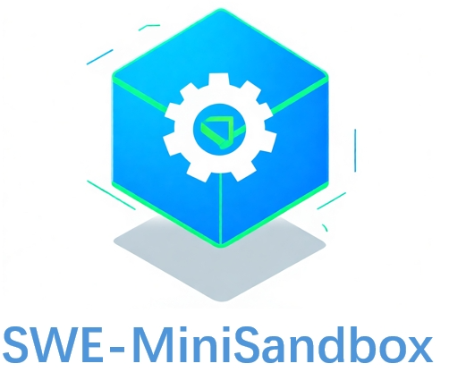

<p align="center">
  <a href="https://github.com/lblankl/SWE-MiniSandbox">
    
  </a>
</p>

<p align="center">
  <b>SWE-MiniSandbox: Container-Free Reinforcement Learning for Building Software Engineering Agents</b>
</p>

---

## Overview

**SWE-MiniSandbox** is a container-free platform for **software engineering automation, AI agents, and code-focused systems**. It aims to provide:

- A container-free, reproducible **mini sandbox environment** for experiments;
- Integration with multiple popular **SWE agents / RL / code-repair frameworks**  
  (e.g., SWE-Agent, SkyRL, SWE-ReX);
- A unified environment preparation pipeline for **SWE-bench, SWE-smith**, and custom datasets;
- Extensible **CLI tools and Python APIs** that you can plug into your own research or systems.

Typical use cases include:

- Train your own SWE-agent with SWE-MiniSandbox;
- Evaluating new models with MiniSadnbox on SWE-bench;
- Building custom pipelines over your own repositories and issue/patch data.

---

## Repository Layout

The core layout of this repository is:

```text

mkdocs.yml          # MkDocs configuration
readme.md           # Project overview and documentation entry

docs/               # Documentation source (MkDocs)
    index.md        # Documentation homepage
    guide/          # Guides and API reference
    img/            # Images used in docs

config/             # Configuration files (env, experiments, models, etc.)
data/               # Data processing scripts and intermediate results
dataset/            # Datasets (or download scripts)
mini-swe-agent/     # Mini SWE Agent core components
pic/                # Additional image resources
R2E-Gym/            # RL / environment components (e.g., R2E-Gym)
sandboxdev/         # Minimal sandbox development & experiments
sh/                 # Shell scripts (setup, batch runs, etc.)
SkyRL/              # SkyRL related code
SWE-agent/          # Modified version of SWE-Agent
SWE-bench/          # SWE-bench utilities and scripts
SWE-ReX/            # Modified version of SWE-ReX
SWE-smith/          # Modified version of SWE-smith
zip/                # Compressed resources

```
---

## Index / Quick Links

- [**Home**](https://lblankl.github.io/SWE-MiniSandbox/)

- [**Quick Start**](https://lblankl.github.io/SWE-MiniSandbox/guide/quick-start/)


- [**Environment Cache & Data Preparation**](https://lblankl.github.io/SWE-MiniSandbox/guide/data/overview/)
    - [Overview](https://lblankl.github.io/SWE-MiniSandbox/guide/data/overview/)
    - [SWE-smith Dataset](https://lblankl.github.io/SWE-MiniSandbox/guide/data/swe-smith/)
    - [SWE-bench Verified Dataset](https://lblankl.github.io/SWE-MiniSandbox/guide/data/swe-bench/)
    - [Custom Dataset](https://lblankl.github.io/SWE-MiniSandbox/guide/data/custom-dataset/)

- [**MiniSandbox CLI Guides**](https://lblankl.github.io/SWE-MiniSandbox/guide/cli/sweagent/)
    - [SWE-Agent CLI Guide](https://lblankl.github.io/SWE-MiniSandbox/guide/cli/sweagent/)
    - [SkyRL CLI Guide](https://lblankl.github.io/SWE-MiniSandbox/guide/cli/skyrl/)

- [**Developer Guides**](https://lblankl.github.io/SWE-MiniSandbox/guide/architecture/)
    - [Architecture Overview](https://lblankl.github.io/SWE-MiniSandbox/guide/architecture/)

    - [**API Reference**](https://lblankl.github.io/SWE-MiniSandbox/guide/api/swe-minisandbox/)
        - [SWE MiniSandbox Deployment API](https://lblankl.github.io/SWE-MiniSandbox/guide/api/swe-minisandbox/)
        - [SWE-Rex API](https://lblankl.github.io/SWE-MiniSandbox/guide/api/swe-rex/)
        - [Sky-RL API](https://lblankl.github.io/SWE-MiniSandbox/guide/api/sky-rl/)

        - **SWE-Agent API**
            - [SWE-Agent Overview](https://lblankl.github.io/SWE-MiniSandbox/guide/api/sweagent/swe-agent/)
            - [Environment API](https://lblankl.github.io/SWE-MiniSandbox/guide/api/sweagent/env/)
            - [Agent API](https://lblankl.github.io/SWE-MiniSandbox/guide/api/sweagent/agent/)
            - [Instance API](https://lblankl.github.io/SWE-MiniSandbox/guide/api/sweagent/instance/)
            - [Tool API](https://lblankl.github.io/SWE-MiniSandbox/guide/api/sweagent/tool/)
            - [Batch-run API](https://lblankl.github.io/SWE-MiniSandbox/guide/api/sweagent/batch-run/)


