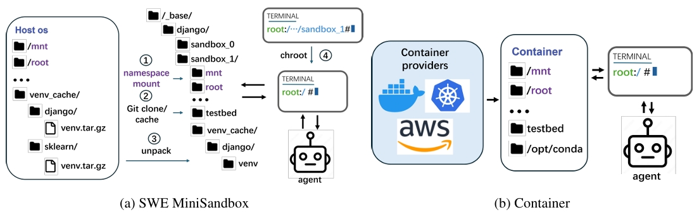

<p align="center">
  <a href="https://lblankl.github.io/SWE-MiniSandbox/">
    
  </a>
</p>

<br>

<div align="center">
  <a href="https://lblankl.github.io/SWE-MiniSandbox/">
    
  </a>
  <a href="https://arxiv.org/abs/2602.11210">
    
  </a>
</div>

---

# SWE-MiniSandbox

SWE-MiniSandbox is a lightweight, container-free framework for isolating batched SWE agent interactions and computing execution-based rewards. It also supports multi-node, on-policy reinforcement learning training without relying on Kubernetes or other container orchestration systems.

The framework relies on Linux namespaces, `chroot`, and bind mounts to create secure and efficient environments where SWE agents can interact with the system while remaining isolated from one another.

Python environments are isolated using `venv`, ensuring that each agent has its own dependencies without interference. These `venv`s are managed using different versions of Conda, providing flexibility in the software stack available to each agent.

<p align="center">
  <a href="https://swesmith.com/">
    
  </a>
</p>

---

## 🚀 Get Started

Read our [documentation](https://lblankl.github.io/SWE-MiniSandbox/index) for detailed instructions on installing and using SWE-MiniSandbox. Before you begin, ensure your machine meets the system requirements below.

### System Requirements

- Linux OS (Ubuntu 20.04+ recommended)
- Namespace isolation support (the `unshare --mount` command must be available)
- Bind mount support (the `mount --bind` command must be available)

### Installation

We provide two installation options:

- **Docker image** for quick setup
- **Manual installation** for full control

See the [Installation Guide](https://lblankl.github.io/SWE-MiniSandbox/guide/quick-start#installation) for step-by-step instructions.

### Quick Start

To get up and running quickly, follow the steps in our [Quick Start Guide](https://lblankl.github.io/SWE-MiniSandbox/guide/quick-start).

---

## Additional Resources

- [Images](https://hub.docker.com/lblankl/swe-minisandbox)  
- [Conda Backend Files](https://huggingface.co/lblankl/MiniSandbox)
- [API Reference](https://lblankl.github.io/SWE-MiniSandbox/guide/cli/sweagent/)
- [Datasets](https://huggingface.co/datasets/lblankl/swe-minisandbox-sft-data6k)

---

## Acknowledgements

SWE-MiniSandbox is built upon:

- [SWE-agent](https://github.com/SWE-agent/SWE-agent)  
- [SWE-smith](https://github.com/SWE-bench/SWE-smith)  
- [SWE-bench](https://github.com/SWE-bench/SWE-bench)  
- [SWE-Rex](https://github.com/SWE-agent/SWE-ReX)  
- [SkyRL](https://github.com/NovaSky-AI/SkyRL)  

Some components are adapted from [R2E-Gym](https://github.com/R2E-Gym/R2E-Gym).

---

## Citation

If you use SWE-MiniSandbox in your research, please cite:

```bibtex
@misc{yuan2026sweminisandboxcontainerfreereinforcementlearning,
      title={SWE-MiniSandbox: Container-Free Reinforcement Learning for Building Software Engineering Agents}, 
      author={Danlong Yuan and Wei Wu and Zhengren Wang and Xueliang Zhao and Huishuai Zhang and Dongyan Zhao},
      year={2026},
      eprint={2602.11210},
      archivePrefix={arXiv},
      primaryClass={cs.SE},
      url={https://arxiv.org/abs/2602.11210}, 
}


